<div align="center">

# 👋 Hi, I'm Avijit Ghosh

### 🤖 AI/ML Engineer • GenAI & LLMs • Computer Vision • Full-Stack Development

Building intelligent systems with **AI, Machine Learning, Generative AI, LLMs, RAG, Computer Vision and modern web technologies.**


</div>

---

## 🧠 About Me

* 🎓 B.E. student at **UIT Bardhaman**, graduating in **2027**
* 🤖 Focused on **Artificial Intelligence, Machine Learning & Generative AI**
* 🧠 Interested in **LLMs, RAG, Corrective RAG and AI Agents**
* 👁️ Building projects in **Computer Vision & Deep Learning**
* 🔗 Working with **LangChain, LangGraph, FAISS, Hugging Face and Ollama**
* ⚡ Building AI APIs and applications using **FastAPI & Streamlit**
* 💻 Also interested in **Frontend Development and modern web technologies**
* 🚀 Experimenting with new AI architectures and real-world applications

---

# 🚀 What I'm Building

```text
                         ┌─────────────────────┐
                         │     AI / ML CORE     │
                         │                     │
                         │  ML • DL • CV • NLP │
                         └──────────┬──────────┘
                                    │
                                    ▼
                         ┌─────────────────────┐
                         │     GENERATIVE AI   │
                         │                     │
                         │ LLMs • RAG • CRAG   │
                         │ Agents • Prompting  │
                         └──────────┬──────────┘
                                    │
                     ┌──────────────┴──────────────┐
                     ▼                             ▼
            ┌──────────────────┐          ┌──────────────────┐
            │   AI BACKENDS    │          │ AI APPLICATIONS  │
            │                  │          │                  │
            │ FastAPI          │          │ Streamlit        │
            │ LangChain        │          │ Web Apps         │
            │ LangGraph        │          │ AI Assistants    │
            └────────┬─────────┘          └────────┬─────────┘
                     │                             │
                     └──────────────┬──────────────┘
                                    ▼
                         ┌─────────────────────┐
                         │   REAL-WORLD AI     │
                         │                     │
                         │ Intelligent Systems │
                         │ & AI Products       │
                         └─────────────────────┘
```

---

# 🛠️ Tech Stack

## 🤖 AI / Machine Learning

<p align="left">


</p>

**Python • NumPy • Pandas • Matplotlib • Scikit-learn • TensorFlow • PyTorch • OpenCV**

---

## 🧠 Generative AI & LLM

<p align="left">


</p>

**LLMs • RAG • Corrective RAG • Prompt Engineering • LangChain • LangGraph • Hugging Face • Ollama • FAISS • BM25 • Cross-Encoder**

---

## 🌐 Backend & APIs

<p align="left">


</p>

**FastAPI • Node.js • Express.js • REST APIs • MySQL • PostgreSQL • Oracle**

---

## 🎨 Frontend

<p align="left">


</p>

**HTML5 • CSS3 • JavaScript • React • Tailwind CSS**

---

## 💻 Programming

<p align="left">


</p>

**Java • Python • C • SQL**

---

## 🔧 Tools & Platforms

<p align="left">


</p>

**Git • GitHub • VS Code • Jupyter • Google Colab • Streamlit**

---

# 🚀 Featured Projects

## 🔎 Corrective RAG — AI Document Intelligence

A retrieval system designed to improve the quality of answers from uploaded documents.

**Key Technologies**

* FAISS dense retrieval
* BM25 sparse retrieval
* Cross-Encoder reranking
* Retrieval quality evaluation
* RAGAS evaluation
* Gemini / LLM integration
* FastAPI backend
* Streamlit interface

```text
PDF
 ↓
Document Processing
 ↓
Chunking
 ↓
 ┌───────────────┬───────────────┐
 │               │               │
FAISS           BM25          Retrieval
Dense           Sparse        Candidates
 │               │               │
 └───────────────┴───────┬───────┘
                         ↓
                Cross-Encoder
                   Reranking
                         ↓
                Quality Evaluation
                         ↓
                       LLM
                         ↓
                      Answer
```

---

## 🤟 Indian Sign Language Recognition

Deep learning system for recognizing Indian Sign Language gestures using landmark-based sequence modeling.

**Technologies**

* MediaPipe Holistic
* PyTorch
* LSTM / Bi-LSTM
* Attention
* Computer Vision
* Sequence Modeling
* Video Processing

```text
Video / Webcam
      ↓
MediaPipe Holistic
      ↓
Body + Hand + Pose Landmarks
      ↓
Feature Sequence
      ↓
Bi-LSTM + Attention
      ↓
Sign / Word Prediction
      ↓
Text / Speech
```

---

## 🩺 Skin Cancer Detection

Deep learning image classification system trained using dermoscopic skin lesion images.

**Technologies**

* TensorFlow
* CNN
* Transfer Learning
* OpenCV
* NumPy
* Pandas
* HAM10000 Dataset

---

## 🖼️ AI Image Authenticity Detector

Computer vision system designed to classify images as real or AI-generated.

**Technologies**

* PyTorch
* EfficientNet-B4
* Computer Vision
* Deep Learning
* Image Classification

---

## ⚖️ AI Due Diligence Copilot

Multi-agent AI system designed to assist with document analysis and due diligence workflows.

```text
                    User
                      │
                      ▼
                AI Orchestrator
                      │
       ┌──────────────┼──────────────┐
       ▼              ▼              ▼
    Legal          Finance       Compliance
     Agent           Agent          Agent
       │              │              │
       └──────────────┼──────────────┘
                      ▼
                 Risk Analysis
                      │
                      ▼
                  Summary / QA
```

**Technologies**

* LangGraph
* LangChain
* RAG
* LLMs
* FastAPI
* Streamlit
* Vector Search

---

# 🧠 AI Engineering Focus

| Area             | Technologies                      |
| ---------------- | --------------------------------- |
| Machine Learning | Scikit-learn, TensorFlow, PyTorch |
| Deep Learning    | CNN, LSTM, Bi-LSTM, Attention     |
| Generative AI    | LLMs, Prompt Engineering          |
| RAG              | FAISS, BM25, Cross-Encoder        |
| AI Agents        | LangChain, LangGraph              |
| Computer Vision  | OpenCV, MediaPipe                 |
| Backend          | FastAPI, REST APIs                |
| AI Apps          | Streamlit                         |
| Databases        | MySQL, PostgreSQL, Oracle         |
| Development      | Git, GitHub, VS Code              |

---

# 📊 GitHub Analytics

<div align="center">

### 🖤 Developer Statistics




<br>

### ⚡ CODE • CONTRIBUTIONS • LANGUAGES

</div>

---

# ◈ CONTRIBUTION ACTIVITY

<div align="center">

```text
╔══════════════════════════════════════════════════════════════════╗
║                                                                  ║
║                  BUILDING • LEARNING • SHIPPING                  ║
║                                                                  ║
╚══════════════════════════════════════════════════════════════════╝
```

<br>


<br>

### `AI / ML`   •   `GENAI`   •   `COMPUTER VISION`   •   `FULL STACK`

<br>

<sub>Every contribution represents another step forward.</sub>

</div>

---

# 🐍 Contribution Snake

<picture>
  <source media="(prefers-color-scheme: dark)" srcset="https://raw.githubusercontent.com/gavijit312/gavijit312/output/github-snake-dark.svg">
  <source media="(prefers-color-scheme: light)" srcset="https://raw.githubusercontent.com/gavijit312/gavijit312/output/github-snake.svg">
  
</picture>

---

# 🤝 Connect With Me

<div align="center">

<a href="https://github.com/gavijit312">

</a>

   

<a href="https://www.linkedin.com/in/avijit-ghosh-530909339/">

</a>

</div>

---

<div align="center">

### 🚀 Building AI. Learning Continuously. Creating Real-World Systems.

</div>
